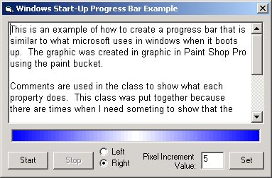



## Windows Start\-Up Progress Bar

### Description

Hey! This creates a type of progress bar like the one Microsoft uses when Windows is loading. This looks so much better than the standard windows progress bar for those times when you just want to show that the computer is working and you don't need to show a percentage of how much is done. I created a class to easily import it into a project. This example has enough comments to understand how it works and how to implement it in your project. I am personally using it in a Splash screen to show that work that must be completed before the user can continue.
 
### More Info
 

             |
---                |---
**Submitted On**   |2000-11-20 04:31:00
**By**             |[Brian Middleton](https://github.com/Planet-Source-Code/PSCIndex/blob/master/ByAuthor/brian-middleton.md)
**Level**          |Beginner
**User Rating**    |4.6 (69 globes from 15 users)
**Compatibility**  |VB 4\.0 \(32\-bit\), VB 5\.0, VB 6\.0
**Category**       |[Custom Controls/ Forms/  Menus](https://github.com/Planet-Source-Code/PSCIndex/blob/master/ByCategory/custom-controls-forms-menus__1-4.md)
**World**          |[Visual Basic](https://github.com/Planet-Source-Code/PSCIndex/blob/master/ByWorld/visual-basic.md)
**Archive File**   |[CODE\_UPLOAD1186211202000\.zip](https://github.com/Planet-Source-Code/brian-middleton-windows-start-up-progress-bar__1-12966/archive/master.zip)

